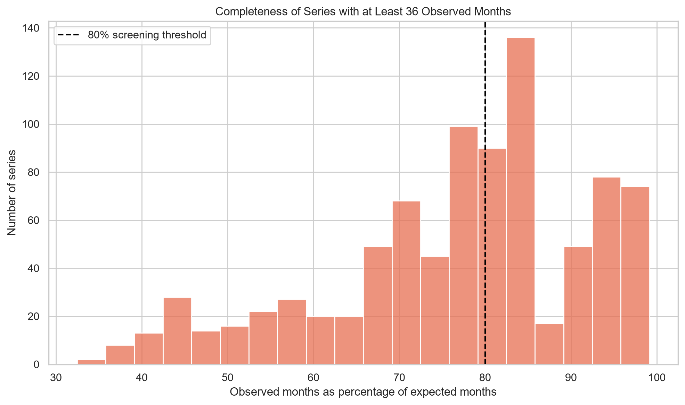
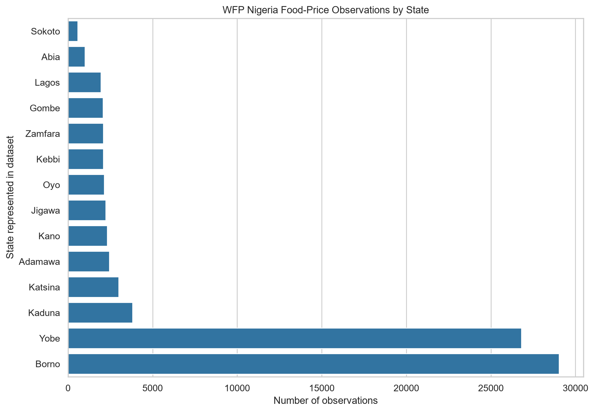
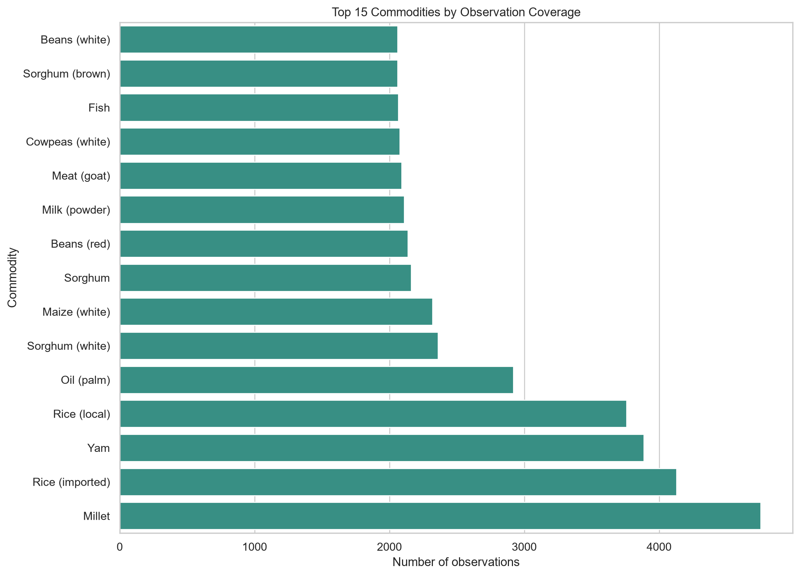
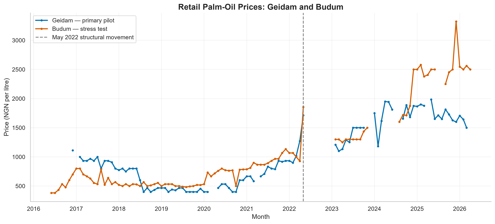
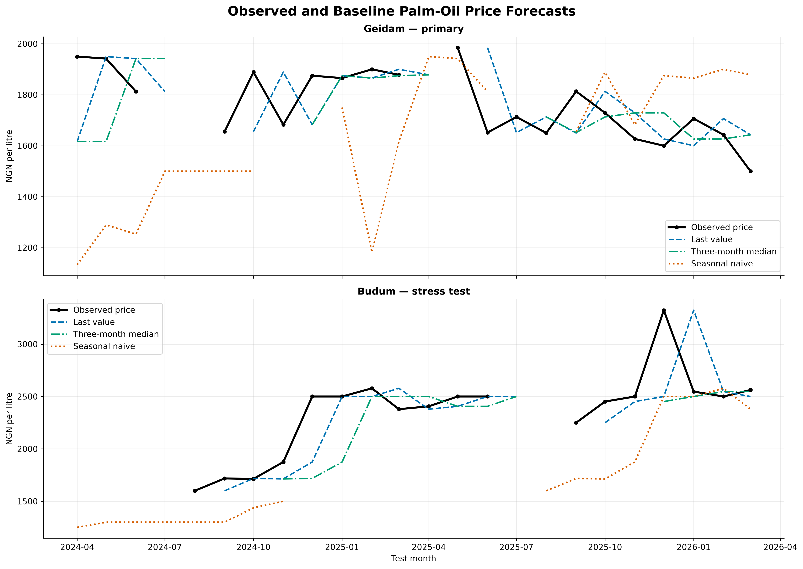

# Nigeria Food Procurement Intelligence Agent

Risk-aware food-price analysis and procurement decision support for Nigerian food businesses using public data, transparent forecasting, optimisation and an evaluated agent workflow.

> **Current status:** Public-data acquisition, validation, exploratory analysis and forecasting baselines are complete. Procurement optimisation, the agent workflow and deployment are planned but have not yet been implemented.

## Executive Summary

Nigerian restaurants, caterers and small food retailers operate in an environment where food prices can change substantially and reliable supplier information may be fragmented.

This project is building a decision-support system that will help a business assess whether selected food items should be purchased, monitored or postponed based on public price history, forecast uncertainty, budget constraints and human-approved business rules.

The current phase establishes the analytical foundation using public World Food Programme food-price data. It implements reproducible data acquisition, automated validation, time-series coverage analysis and honest forecasting baselines.

The analysis does not treat a forecast as a guaranteed future price. It distinguishes observed data, calculated estimates and conclusions that require additional evidence.

## Project Status

| Component | Status |
|---|---|
| Public dataset acquisition | Complete |
| Dataset provenance documentation | Complete |
| Automated data validation | Complete |
| Exploratory data analysis | Complete |
| Pilot-series selection | Complete |
| Transparent forecasting baselines | Complete |
| Automated baseline tests | Complete |
| Advanced statistical modelling | Planned |
| Procurement optimisation | Planned |
| AI-agent workflow | Planned |
| Public application and API | Planned |

## Business Problem

A Nigerian food business may need to decide:

- what commodities to purchase;
- when to purchase them;
- which market-price movements require attention;
- how much uncertainty surrounds a price estimate;
- whether the expected procurement basket remains within budget.

The intended system will eventually answer:

> Given a required food basket, budget, location and purchasing deadline, which items should be purchased now, monitored or postponed?

The current dataset does not contain supplier quotations, transport costs, product quality or business-specific purchasing requirements. Therefore, this phase focuses on historical market-price intelligence rather than final supplier selection.

## Why This Matters

Poor procurement timing can reduce already narrow SME margins. However, an unnecessarily complex model is not automatically useful.

This project therefore begins with transparent baselines that advanced models must outperform. This prevents technical complexity from being mistaken for business value.

## Current Architecture


The current repository implements the first four stages. The final optimisation and agent layer will be introduced only after the underlying decision logic is defensible.

## Dataset and Provenance

| Field | Details |
|---|---|
| Dataset | Nigeria - Food Prices |
| Original publisher | World Food Programme |
| Hosting platform | Humanitarian Data Exchange |
| Source classification | Official WFP dataset hosted by HDX |
| Format | CSV |
| Downloaded snapshot | 4 September 2026 |
| File size | 9,948,580 bytes |
| Observations | 81,534 |
| Variables | 16 source variables |
| Observed coverage | January 2002-July 2026 |
| Currency | Nigerian naira |
| Licence | Creative Commons Attribution for Intergovernmental Organisations |
| SHA-256 | `b78b4aaefd6aaba6e9bf45eed80e9e6947cf869a716e99f7d135638d868808c9` |

Dataset page: [WFP Nigeria Food Prices on HDX](https://data.humdata.org/dataset/wfp-food-prices-for-nigeria)

The raw CSV is deliberately excluded from Git. It can be downloaded using the repository's acquisition script.

## Important Variables

| Variable | Meaning |
|---|---|
| `date` | Observation date |
| `admin1` | First-level administrative area or state |
| `admin2` | Second-level administrative area |
| `market` | Market name |
| `market_id` | Market identifier |
| `latitude`, `longitude` | Market coordinates |
| `category` | Commodity category |
| `commodity` | Commodity name |
| `commodity_id` | Commodity identifier |
| `unit` | Measurement unit |
| `priceflag` | Observation category supplied by the publisher |
| `pricetype` | Retail or wholesale |
| `currency` | Price currency |
| `price` | Local-currency price |
| `usdprice` | US-dollar price supplied in the source |

## Data Validation

The validation pipeline checks:

- required columns;
- empty datasets;
- date parsing;
- numeric and positive prices;
- currency values;
- retail and wholesale classification;
- measurement units;
- exact and logical duplicates;
- geographic-coordinate plausibility;
- market and commodity identifier consistency.

The downloaded snapshot produced:

| Check | Result |
|---|---:|
| Invalid dates | 0 |
| Invalid prices | 0 |
| Non-positive prices | 0 |
| Missing individual cells | 0 |
| Exact duplicate rows | 0 |
| Duplicate observation keys | 0 |
| Globally impossible coordinates | 0 |
| Coordinates outside broad Nigerian boundaries | 0 |

A dataset can contain no empty cells while still having missing calendar months. Time-series completeness was therefore evaluated separately.

## Exploratory Analysis

The dataset contains:

- 14 represented states;
- 68 markets;
- 43 commodities;
- 61,868 retail observations;
- 19,666 wholesale observations;
- 1,857 distinct market-commodity-unit-price-type series.

Important coverage findings:

| Measurement | Series |
|---|---:|
| Total series | 1,857 |
| Series containing missing months | 1,539 |
| Series with no internal missing months | 318 |
| Series with at least 36 observations | 875 |
| Series with at least 36 observations and 80% completeness | 430 |
| Series with at least 60 observations | 623 |
| Series updated within the latest 12 months | 1,035 |
| Series containing only `actual` observations | 146 |

No sufficiently long, complete and recent candidate retained one price-flag type throughout its complete history. Price-flag consistency was therefore treated as a diagnostic characteristic rather than an absolute exclusion condition.



### Coverage Concentration

Borno contains the largest number of observations, while Potiskum has the highest market-level observation count. Millet is the most frequently represented commodity.

The dataset covers only 14 states and should not be presented as nationally representative of every Nigerian market.





## Structural-Movement Investigation

Budum retail palm oil increased from NGN 928 per litre in April 2022 to NGN 1,856 in May 2022, representing a 100% increase.

A cross-commodity investigation found:

- 24 commodities with comparable April and May observations;
- a median price increase of 99.86%;
- 14 commodities increasing by at least 90%.

The result is consistent with a broad structural movement affecting several Budum commodities. The dataset alone cannot establish whether this represents a genuine market shock, changed measurement, changed collection practices or a combination of factors.

The observation was retained rather than silently deleted.

## Missingness Investigation

The Budum palm-oil series contains 18 missing calendar months.

Among 13 other Budum retail series covering the same full period:

- all 13 shared the same 18 missing months;
- nine had exactly the same missing pattern.

This is consistent with market-level reporting interruptions rather than palm-oil-specific missingness. The precise cause cannot be determined from the dataset alone.

Long gaps were not filled using interpolation or future observations.

## Pilot-Series Selection

Two like-for-like retail palm-oil series measured in litres were selected.

| Role | Market | State | Observed months | Completeness |
|---|---|---|---:|---:|
| Primary pilot | Geidam | Yobe | 95 | 84.82% |
| Stress test | Budum | Borno | 101 | 84.87% |

Geidam was selected as the primary pilot because it had two price-flag types and a smaller maximum consecutive-month movement than Budum.

Budum was retained as a stress test because its structural movement and systematic gaps provide a more difficult evaluation environment.



## Mathematical Baselines

### Last Value

$$
\hat{y}_t=y_{t-1}
$$

The previous calendar month's observed price becomes the forecast.

### Three-Month Rolling Median

$$
\hat{y}_t=\operatorname{median}(y_{t-1},y_{t-2},y_{t-3})
$$

This smooths short-term variation and is less sensitive to one extreme value than a mean.

### Seasonal Naive

$$
\hat{y}_t=y_{t-12}
$$

The observation from the same month one year earlier becomes the forecast.

No method automatically fills missing historical prices.

## Evaluation Design

The final 24 common calendar months, April 2024-March 2026, were reserved for walk-forward testing.

At every forecast origin, only earlier observations were used. Random train/test splitting was avoided because it would introduce future information into earlier predictions.

Geidam contained 21 observed test targets. Budum contained 18.

The evaluation reports Mean Absolute Error, Weighted Absolute Percentage Error, forecast bias, prediction coverage and business-friendly tolerance rates.

## Baseline Results

### Native-Coverage Results

| Series | Baseline | Predictions | Coverage | MAE | WAPE | Bias |
|---|---|---:|---:|---:|---:|---:|
| Geidam | Last value | 19 | 90.48% | NGN 121.92 | 6.93% | 0.20% |
| Geidam | Three-month median | 15 | 71.43% | NGN 115.93 | 6.56% | -2.21% |
| Geidam | Seasonal naive | 17 | 80.95% | NGN 312.70 | 17.63% | -8.04% |
| Budum | Last value | 16 | 88.89% | NGN 204.14 | 8.47% | -3.14% |
| Budum | Three-month median | 12 | 66.67% | NGN 252.49 | 10.04% | -8.31% |
| Budum | Seasonal naive | 11 | 61.11% | NGN 399.73 | 17.56% | -16.93% |

### Common-Target Results

The methods were also evaluated on identical target months. For Geidam, 13 common targets were available:

| Baseline | MAE | WAPE | Bias |
|---|---:|---:|---:|
| Last value | NGN 94.34 | 5.34% | -0.21% |
| Three-month median | NGN 114.11 | 6.46% | -1.99% |
| Seasonal naive | NGN 351.35 | 19.89% | -8.70% |

Only five common targets were available for Budum, so its common-target ranking is not considered conclusive.

The last-value method was selected as the reference baseline because it combined strong Geidam accuracy, high forecast coverage, approximately neutral bias and transparent business logic.



## Business-Friendly Tolerance

For the last-value baseline:

| Series | Within 5% | Within 10% | Within 20% | Maximum error |
|---|---:|---:|---:|---:|
| Geidam | 47.37% | 73.68% | 94.74% | 20.19% |
| Budum | 56.25% | 81.25% | 81.25% | 30.49% |

Budum was often close during ordinary months but produced larger observed errors around sharp price movements. Geidam had fewer predictions within 5% but a smaller maximum error.

These thresholds are illustrative. A real business must define acceptable error according to purchasing volume, margins and risk appetite.

## What an Advanced Model Must Beat

An advanced model will not be accepted merely because it is more sophisticated. It should:

- beat the last-value baseline on identical target months;
- maintain useful forecast coverage;
- avoid material systematic bias;
- remain robust on the Budum stress-test series;
- explain how it handles gaps and structural movements;
- demonstrate meaningful improvement outside the training period.

## Repository Structure

```text
nigeria-food-procurement-agent/
├── README.md
├── LICENSE
├── requirements.txt
├── assets/
├── data/
│   ├── README.md
│   ├── raw/
│   └── processed/
├── docs/
├── notebooks/
│   ├── 01_data_validation_and_eda.ipynb
│   └── 02_forecasting_baselines.ipynb
├── scripts/
│   └── download_wfp_data.py
├── src/
│   ├── validation.py
│   └── baselines.py
└── tests/
    ├── test_validation.py
    └── test_baselines.py
```

Raw and processed data files are excluded from Git.

## Installation

Clone the repository:

```bash
git clone https://github.com/emeka8301/nigeria-food-procurement-agent.git
cd nigeria-food-procurement-agent
```

Create and activate an appropriate Python environment, then install the dependencies:

```bash
python -m pip install -r requirements.txt
```

## Reproduction

Download the public dataset:

```bash
python scripts/download_wfp_data.py
```

Run validation:

```bash
python src/validation.py
```

Run the automated tests:

```bash
python -m pytest -v
```

Launch JupyterLab:

```bash
jupyter lab
```

Run the notebooks in order:

1. `notebooks/01_data_validation_and_eda.ipynb`
2. `notebooks/02_forecasting_baselines.ipynb`

## Automated Tests

The repository currently contains 14 automated tests covering dataset validation, baseline formula correctness, missing-price handling, separation between series, calendar alignment, duplicate detection, metric calculations and forecast coverage.

Passing tests confirm implementation correctness. They do not prove that future prices are reliably predictable.

## Limitations

- Only 14 states are represented.
- Market and commodity coverage is uneven.
- Many series contain systematic reporting gaps.
- Some commodities use multiple measurement units.
- Retail and wholesale observations are not interchangeable.
- Price-flag regimes change over time.
- Prices are nominal and may reflect broader inflation.
- Supplier quotations, quality, transport, storage and quantity discounts are unavailable.
- Baseline test samples are relatively small.
- No causal claims are made.
- No prediction intervals have yet been implemented.
- The system is not a live quotation or automatic purchasing service.

## Ethical, Privacy and Security Boundaries

This project uses only independently obtained public data and clearly labelled analytical outputs.

It contains no employer, customer or client information. It does not use internal alerts, logs, tickets, usernames, IP addresses, hostnames, architecture, screenshots, controls or workplace-derived datasets.

Forecasts are decision-support evidence. A human must retain control of material procurement decisions.

## Planned Development

Future phases will consider:

- additional statistical forecasting models;
- uncertainty intervals;
- structural-break sensitivity analysis;
- procurement-basket optimisation;
- budget and risk constraints;
- API and application development;
- agent tool use and structured outputs;
- human approval;
- agent evaluation, logging, cost and latency monitoring;
- public deployment using demonstration inputs.

## What I Learned

This phase demonstrated that basic schema validity is not the same as time-series suitability.

A dataset can contain no null cells while still having systematic calendar gaps. Candidate selection must consider units, price types, history, completeness, recency, observation regimes and structural movements.

The work also demonstrated why a model prediction is not automatically a fact. Data quality, context, uncertainty and missing evidence must be examined before a result is turned into a business recommendation.

## Data Sources

- [World Food Programme Nigeria food-price dataset](https://data.humdata.org/dataset/wfp-food-prices-for-nigeria)
- [Humanitarian Data Exchange](https://data.humdata.org/)

## Licence

See the repository's `LICENSE` file for the project licence. The source dataset remains subject to the publisher's separate licence and usage conditions.
